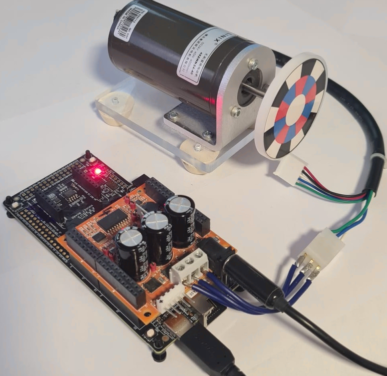
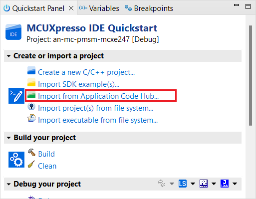
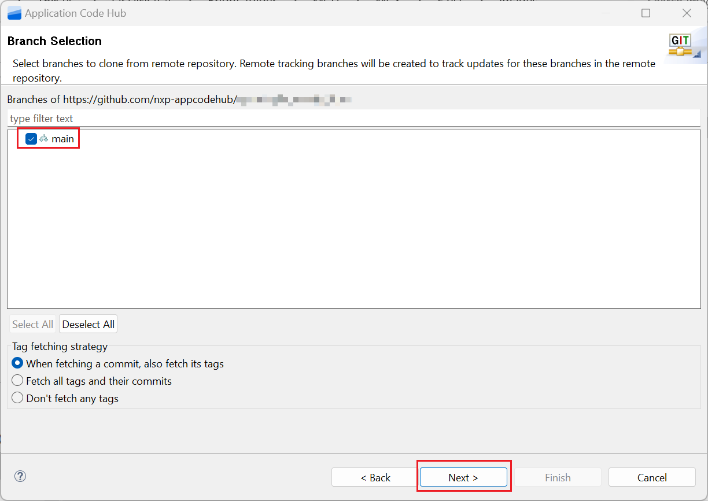
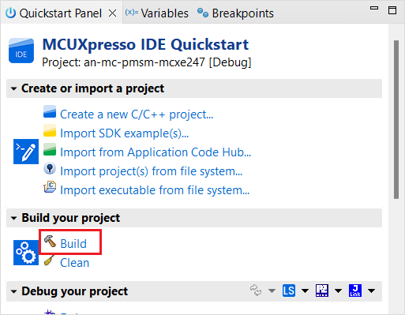
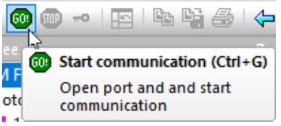

# NXP Application Code Hub

## AN14616: Sensorless Field oriented Control (FOC) on MCXE24x
This application note describes the implementation of FOC on NXP MCX E247 MCUs, including sensorless control and quadrature encoder based control. Please refer to AN14616 <!--[AN14616](https://www.nxp.com/docs/en/application-note/AN14616.pdf)Will add after release --> for complete instructions on how to use this software.      

The demo code for PMSM sensorless control uses following NXP platforms:

• FRDM-MCXE247

• Freedom Development Platform for Low-Voltage, 3-Phase PMSM Motor Control (FRDM-MC-LVPMSM)

• Motor LINIX 45ZWN24-40 or Teknic M-2310P     

The document is divided into several parts. Hardware setup, processor features, and peripheral settings are described at the beginning of the document. The next part contains the PMSM project description and motor control peripheral initialization. The last part describes user interface and additional example features.

#### Boards: FRDM-MCXE247
#### Categories: Motor Control
#### Peripherals: ADC, PWM
#### Toolchains: MCUXpresso IDE

## Table of Contents
1. [Software](#step1)
2. [Hardware](#step2)
3. [Setup](#step3)
4. [Results](#step4)
5. [FAQs](#step5) 
6. [Support](#step6)
7. [Release Notes](#step7)

## 1. Software
- Download and install [MCUXpresso IDE V25.06 or later](https://www.nxp.com/design/design-center/software/development-software/mcuxpresso-software-and-tools-/mcuxpresso-integrated-development-environment-ide:MCUXpresso-IDE).
- [SDK_25_06_00_FRDM-MCXE247](https://mcuxpresso.nxp.com/zh)
- Download and install the latest version of [FreeMASTER](https://www.nxp.com/design/software/development-software/freemaster-run-time-debugging-tool:FREEMASTER)(3.2.2.2).
- Download the code from Git repository an-mc-pmsm-mcxe247 <!--[an-mc-pmsm-mcxe247](https://github.com/nxp-appcodehub/an-mc-pmsm-mcxe247/browse)-->.  
- MCUXpresso for Visual Studio Code: This example supports MCUXpresso for Visual Studio Code, for more information about how to use Visual Studio Code please refer [here](https://www.nxp.com/design/design-center/training/TIP-GETTING-STARTED-WITH-MCUXPRESSO-FOR-VS-CODE).

## 2. Hardware

- [FRDM-MCXE247 board](https://www.nxp.com/design/design-center/development-boards-and-designs/FRDM-MCXE247?tab=Buy_Parametric_Tab#buy)
- [FRDM-MC-LVPMSM](https://www.nxp.com/design/development-boards/freedom-development-boards/mcu-boards/)
- Motor: Linix [45ZWN24-40](https://www.nxp.com/design/development-boards/freedom-development-boards/mcu-boards/low-voltage-3-phase-motor-for-frdm-platform:FRDM-MC-LVMTR), or Teknic M-2310P
- USB Type-C cable
- Personal Computer

## 3. Setup

### 3.1 Hardware Setup

Connect the **FRDM-MC-LVPMSM** shield to the **J1~J4** arduino connector of **FRDM-MCXE247** board. Connect the 3-phase wire of the motor to the **J7** connector on **FRDM-MC-LVPMSM** according to phase sequence.  

For motor LINIX 45ZWN24-40:  
**White wide** --phase**A**;  
**Bule wide** --phase**B**;  
**Green wide** --phase**C**.  

For motor Teknic M-2310P:  
**Black wide**--phase**A**;  
**Red wide**--phase**B**;  
**White wide**--phase**C**.  

If use quadrature encoder on Teknic M-2310P, connect the sensor wire from the motor to **J8** on **FRDM-MC-LVPMSM**:  
**Red**-J8-**5V**;  
**Black**--J8-**GND**;  
**Blue**--J8-**ENCA**;  
**Orange**--J8-**ENCB**;  
**Brown**--J8-**ENCI**.

Power the **FRDM-MC-LVPMSM** board on **J6** with a **24V** adaptor.   

Use a USB type-C cable to connect to the **FRDM-MCXE247** board via **J13** connector. Download the code using debug button in tool bar after compiler. Select **CMSIS-DAP** or **J-Link** in **Debug As** according firmware in your on-board debugger.   

   

### 3.2 Import Project

1. Open MCUXpresso IDE, in the Quick Start Panel, choose **Import from Application Code Hub**. 

   

2. Enter the demo name in the search bar.  

   

3. Click **Copy GitHub link**, MCUXpresso IDE will automatically retrieve project attributes, then click **Next>**.  

   

4. Select **main** branch and then click **Next>**, Select the MCUXpresso project, click **Finish** button to complete import.  

   

5. Click **Build** to start compiling the project. 

   

6. Select the **GUI Flash Tool** from the toolbar to program the executable to the board. 

   

### 3.3 User interface   

The application contains the demo mode to demonstrate motor rotation. You can operate it either using the user button, or using FreeMASTER.   

1. The NXP development boards include a user button associated with a port interrupt (generated whenever one of the buttons is pressed). At the beginning of the ISR, a simple logic executes and the interrupt flag clears. When you press the button, the demo mode starts. When you press the same button again, the application stops and transitions back to the STOP state.  

​	The user button on the development board (controlling the demo mode):FRDM-MCXE247 - SW2

2. The other way to interact with the demo mode is to use the FreeMASTER tool. The FreeMASTER application consists of two parts: the PC application used for variable visualization and the set of software drivers running in the embedded application. The serial interface transfers data between the PC and the embedded application. This interface is provided by the debugger included in the boards.  

​	Remote control using FreeMASTER (Following chapter): Setting a variable in the FreeMASTER Variable Watch

### 3.4 Motor configuration
There are two motor parameter and control parameter header file in **source** folder of the project, **"m1_pmsm_appconfig.h"** is for **LINIX 45ZWN24-40** and **"m2_pmsm_appconfig.h"** is for **Teknic M-2310P**.

If use **LINIX 45ZWN24-40** , **m1_pmsm_appconfig** should be included in header file **m1_sm_snsless.h** (an-mc-pmsm-mcxe247\motor_control\pmsm\pmsm_float\mc_state_machine) by default. 

If use **Teknic M-2310P**, change the included file to **m2_pmsm_appconfig**.

### 3.5 Remote control using FreeMASTER  

This section provides information about the tools and recommended procedures to control the sensor/ sensorless PMSM Field-Oriented Control (FOC) application using FreeMASTER.   

You can download the latest version of FreeMASTER at www.nxp.com/freemaster. To run the FreeMASTER application including the MCAT tool, double-click the pmsm_float.pmpx file located in the middleware\motor_control\freemaster 

folder. The FreeMASTER application starts and the environment is created automatically, as defined in the *.pmpx file.

Note: In MCUXpresso, the FreeMASTER application can run directly from IDE in motor_control/ freemaster folder.

1. Download the project from your chosen IDE to the MCU and run it.

2. Open the FreeMASTER project pmsm_float.pmpx 

To establish the communication, click the communication button (the green "GO" button in the top left-hand corner).

  

4. If the communication is established successfully, the FreeMASTER communication status in the bottom right-hand corner changes from "Not connected" to "RS-232 UART Communication; COMxx; speed=115200". Otherwise, the FreeMASTER warning pop-up window appears. as below:

  

6. Control the PMSM motor by writing to a control variable in a variable watch.

7. If use quadrature encoder based sensor control on **Teknic M-2310P**, switch **M1 MCAT_POSE_Sensor** value to **1**(**0** by default for sensorless control) in **Variable watch** window of **3. Speed Control** watch subblock.

## 4. Result
The board can drive the motor and motor can run.

#### Project Metadata

<!----- Boards ----->

<!----- Categories ----->

<!----- Peripherals ----->

<!----- Toolchains ----->

Questions regarding the content/correctness of this example can be entered as Issues within this GitHub repository.

>**Warning**: For more general technical questions regarding NXP Microcontrollers and the difference in expected functionality, enter your questions on the [NXP Community Forum](https://community.nxp.com/)

## 5. Release Notes
| Version | Description / Update                           | Date                        |
|:-------:|------------------------------------------------|----------------------------:|
| 1.0     | Initial release on Application Code Hub        | July 22th 2025 |
